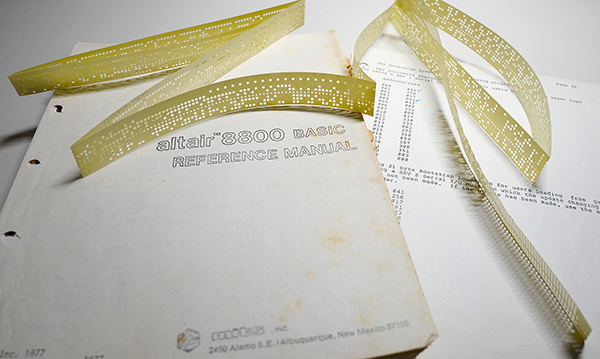
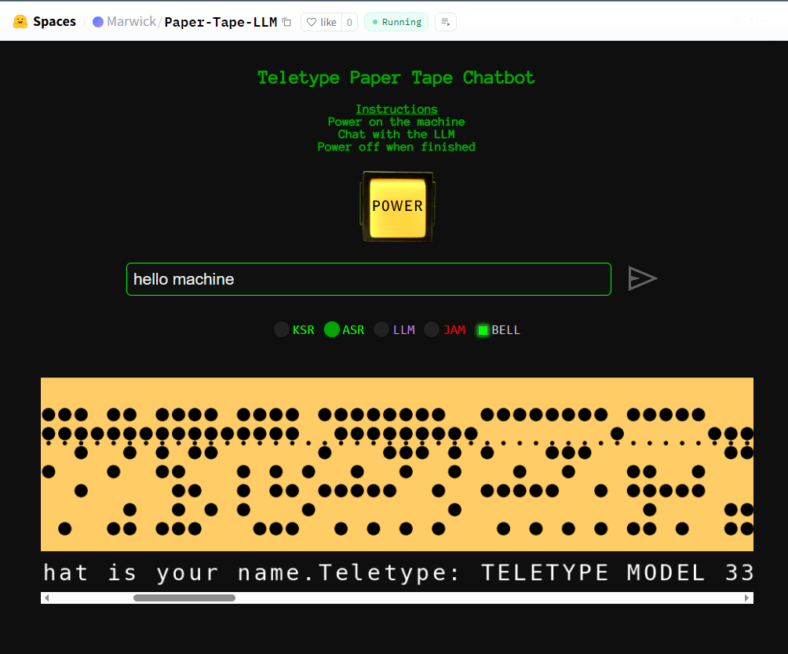

# Paper Tape LLM (Hugging Face)

A retro-themed chatbot interface that mimics a 1970s Teletype Model 33 ASR printing LLM responses on animated virtual paper tape.

Built with Flask, Matplotlib, and the Hugging Face Inference API (LLaMA-3 or other), this open-source project lets you deploy an interactive LLM chat interface with sound, blinking LEDs, and fully rendered punch tape output.

---

## Features

- Blinking LLM LED while generating
- Paper tape visualization using Matplotlib
- Optional ASCII bell audio support
- Uses Hugging Face Inference Endpoints (e.g., LLaMA-3-8B)
- Easily deployable as a Hugging Face Space

---

## Requirements

- Python 3.9+
- `pip install -r requirements.txt`

---

## Running Locally

```bash
git clone https://github.com/YOUR_USERNAME/paper-tape-llm.git
cd paper-tape-llm
pip install -r requirements.txt
python app.py
```

Then open your browser to: [http://localhost:7860](http://localhost:7860)

---

## Config

Set this environment variable in `.env` or your server:

```bash
HF_TOKEN=your_huggingface_inference_token
```

The token should belong to a Hugging Face Inference Endpoint (e.g., LLaMA 3 model).

---

## Screenshots

### Inspired by the MITS Altair 8800 era





---

## Project Structure

```
paper-tape-llm/
├── app.py                 # Main backend
├── static/                # Frontend HTML/CSS/JS/assets
├── requirements.txt
├── README.md
```

---

## License

MIT — use freely, credit kindly.

---

## Contact

Created by [@m15-ai](https://github.com/m15-ai). Questions or contributions welcome!
